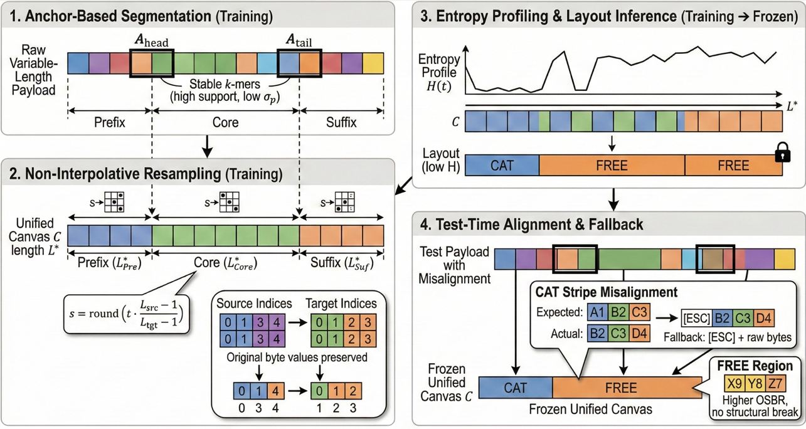

# Code and Models for "[PRGen]"

This is the official repository for our paper, "[PRGen]".


# 1. RELATED WORK

**Generic Traffic Representation & Analysis**

The adaptation of Transformer architectures to network traffic has demonstrated remarkable efficacy in capturing complex dependencies within byte streams. NetGPT  adapts the GPT-2 architecture to traffic, employing a general hexadecimal encoding to unify diverse patterns into a text-like format for autoregressive generation. Similarly, TrafficLLM  leverages Large Language Models (LLMs) like Llama-2, introducing a traffic-domain tokenization strategy and a dual-stage tuning pipeline to align natural language instructions with raw traffic data. While primarily an encoder-based representation learner, TrafficFormer  aligns with the generative paradigm through its use of Masked Burst Modeling (MBM) as a pre-training objective. By reconstructing masked intervals within traffic "bursts," it learns robust structural embeddings from unlabeled data. However, these approaches generally treat traffic as a linear sequence or rely on standard NLP tokenization (BPE/WordPiece), which proves suboptimal for the high-entropy, rigid structural constraints of proprietary binary streams.

**Proprietary Protocol Traffic Generation**

Research targeting proprietary or industrial protocols is sparse due to the lack of public specifications. The most relevant predecessor, PNetGPT, targets Industrial IoT (IIoT) protocols by mapping internal API function calls to network payloads. It employs an Encoder-Decoder architecture with a regex-based tokenization scheme designed to preserve numerical semantics (e.g., floating-point coordinates). However, PNetGPT operates under a "white-box" or "grey-box" assumption, necessitating access to the host software's internal API logs (function names and parameters) as conditioning inputs. This dependency renders it unsuitable for black-box security auditing or active scanning scenarios where internal device states are inaccessible.

**Positioning of PRGen**

PRGen  distinguishes itself by targeting the challenging black-box generation of proprietary IoT probe responses, conditioned solely on external interaction context (e.g., probe parameters, device fingerprints) rather than internal API logs. Unlike PNetGPT's reliance on heuristic regex rules or TrafficLLM's general BPE, PRGen introduces Stripe-Aware Conditional Tokenization (SACT). SACT is a data-driven approach that utilizes entropy profiles to dynamically segment payloads into rigid "stripes" (static structures) and variable fields, preserving structural integrity without prior knowledge. Furthermore, we propose Entropy-Guided Masking (EGM), a pre-training strategy that strategically biases learning towards high-entropy regions, contrasting with the uniform masking or next-token prediction used in prior work. This positioning highlights PRGen's unique capability to synthesize valid binary payloads for unknown protocols in zero-knowledge environments.

## Table 1. Comparison of PRGen with State-of-the-Art Transformer-based Traffic Models

| Model         | Target Domain                        | Input Conditioning                        | Tokenization Strategy               | Training Strategy                                      | Generation Granularity |
|---------------|--------------------------------------|-------------------------------------------|--------------------------------------|--------------------------------------------------------|------------------------|
| **NetGPT**        | General / Encrypted Traffic          | Task Prompts                              | Hex + WordPiece                      | Autoregressive (CLM)                                   | Flow / Packet          |
| **TrafficLLM**    | Generic Malware / Web Attacks        | Natural Language Instructions             | Traffic-Domain BPE                   | Dual-Stage (Instruction + Traffic)                     | Flow / Packet          |
| **TrafficFormer** | General / Encrypted Classification     | Unlabeled Bursts                          | Bigram + BPE                         | Masked Burst Modeling (MBM) & SODF                     | Burst / Flow             |
| **PNetGPT**       | Proprietary Industrial Protocols     | API Function Names & Params               | Hex-split + Special Tokens           | Masked (MLM) & Autoregressive (ALM)                    | Payload Byte Stream      |
| **PRGen (Ours)**  | Proprietary IoT Probe-Response       | Interaction Context (Probe & Device Attr) | SACT (Entropy-Profile Driven)      | EGM (Entropy-Guided Masking)                           | Payload Byte Stream      |


# 2.2. Structural Analysis (Revised)

To expose the latent grammar within opaque byte streams, we implement a three-stage pipeline: anchor-based segmentation, non-interpolative resampling, and entropy-guided layout inference. This process transforms variable-length payloads into a fixed-dimensional canvas $C$ of length $L^*$. Algorithm 1 details the procedure.

**Anchor-Based Segmentation**

We partition the corpus by interaction context. Within each group, we identify structural landmarks (anchors) to handle length variance. We search for candidate $k$-mers ($k \in \{4, 5, 6\}$) that act as invariant identifiers. An anchor candidate must satisfy two criteria: (1) *Support* $\ge 30\%$ of the group population, and (2) Positional standard deviation $\sigma_p \le 3$ bytes. These thresholds were empirically selected to prioritize stability over coverage. Candidates are scored by $S = \text{support}/(\sigma_p + 1)$, and the highest-scoring landmarks are selected as $A_{head}$ and $A_{tail}$ to segment payloads into *Prefix*, *Core*, and *Suffix* regions.

**Non-Interpolative Resampling**

Standard signal resampling is invalid for binary protocols as it invents non-existent intermediate values. Instead, we employ a monotone, nearest-neighbor index mapping. For a region with raw length $L_{src}$ and target length $L_{tgt}$ (set to the median length of that region in training), we map each target index $t \in [0, L_{tgt}-1]$ to a source index $s$:

$$
s = \text{round}\left( t \cdot \frac{L_{src}-1}{L_{tgt}-1} \right)
$$

The aligned byte at $t$ is $x[s]$. This preserves original byte values while normalizing length. This is applied independently to Prefix, Core, and Suffix.

**Entropy Profiling and Layout Inference**

We compute position-wise Shannon entropy $H(t)$ on the aligned canvas and apply PELT change-point detection to segment it into low-entropy `CAT` stripes and high-entropy `FREE` regions.

Critically, the canvas length $L^*$, anchor definitions, and `CAT`/`FREE` layout are derived solely from the training split and **frozen**. During testing, incoming payloads are aligned using these frozen parameters. Misalignments caused by unseen length variations result in bytes falling into incorrect columns; rather than breaking the pipeline, these shifts manifest as `[ESC]` fallback events in `CAT` stripes or higher OSBR, quantitatively capturing structural divergence.


## Algorithm 1: Structural Analysis Pipeline

```text
Algorithm 1: Structural Analysis Pipeline
--------------------------------------------------------------------------------
Input:  Payload set P
        Thresholds: support (θ_sup = 0.3), std_dev (θ_std = 3.0)
Output: Frozen Layout L, Target Lengths L*


1:  // Stage 1: Anchor Mining
2:  candidates = []
3:  for each k in {4, 5, 6} do
4:      for each k-mer m in P do
5:          Calculate support (S) and position std (σ_p)
6:          if S >= θ_sup  AND  σ_p <= θ_std then
7:              score = S / (σ_p + 1)
8:              Add (m, score) to candidates
9:          end if
10:     end for
11: end for
12: Select optimal A_head, A_tail from candidates maximizing score

13: // Stage 2: Canvas Definition
14: Define segments R in {Prefix, Core, Suffix} via anchors
15: for each region R do
16:     L*_R = Median(length of r for all r in R)
17: end for

18: // Stage 3: Alignment & Profiling
19: Align all payloads p in P to L*_R using Nearest-Neighbor (Eq. 1)
20: Compute smoothed entropy profile H
21: L = PELT(H)   // Segment into CAT/FREE regions
22: return L
--------------------------------------------------------------------------------
```



**Fig. 1: The Structural Analysis and Alignment Pipeline.**

**1. Anchor-Based Segmentation:** Stable $k$-mers ($A_{head}$, $A_{tail}$) with high support and low positional variance partition payloads into variable-length regions. 
**2. Non-Interpolative Resampling:** Variable regions are mapped to a fixed length $L^*$ using a nearest-neighbor rounding formula (Eq. 1). The example highlights how source bytes are selected without interpolation, preserving original values. 
**3. Entropy Profiling & Layout Inference:** The entropy profile $H(t)$ defines `CAT` (structural) and `FREE` (variable) stripes. This layout is frozen after training. 
**4. Test-Time Alignment & Fallback:** Misalignments on unseen test data do not break the model; they manifest as `[ESC]` sequences in rigid `CAT` stripes or as increased Out-of-Support Byte Rate (OSBR) in `FREE` regions.


# 3. Supplementary Experiment: Discriminator-Based Validation
To assess the structural validity of PRGen-generated payloads in the absence of proprietary device emulators, we conducted a task-facing discriminator evaluation. This experiment was designed to determine whether a standard machine learning classifier could distinguish between real-world traffic and payloads synthesized by PRGen. We constructed a strictly balanced binary classification dataset consisting of 10,000 ground-truth payloads sampled from the held-out test set and 10,000 generated payloads conditioned on the corresponding interaction contexts.

We trained a Random Forest classifier (100 estimators) to differentiate between the two classes. To ensure a rigorous evaluation, we employed comprehensive feature engineering using byte-level n-grams (ranging from 1-gram to 3-gram) vectorized via TF-IDF, capturing both atomic byte distributions and local protocol patterns. The model was evaluated using 5-fold cross-validation.

The discriminator achieved an F1-score of 0.54, a result marginally above the random-guess baseline of 0.50. This near-random performance indicates that even with rich sequential features, the classifier failed to find consistent decision boundaries to separate real from generated samples. These results confirm that PRGen successfully models the implicit grammar of proprietary protocols, producing payloads that possess the same structural and statistical characteristics as genuine traffic.


# 4. Baseline Expansion
To further substantiate the comparative evaluation and position PRGen against the latest state-of-the-art, we are currently expanding our baseline set to include PNetGPT (ICASSP 2025) , TrafficLLM , and TrafficFormer. We are actively reproducing these models and adapting their flow-centric architectures to address the specific I/O constraints of interaction-context-conditioned payload generation. Furthermore, to rigorously isolate the performance gains attributable to our structural alignment preprocessing, we are introducing a naïve "Raw-Byte T5" baseline that operates on unaligned sequences. These additional experiments are currently in progress, and the corresponding implementations, training configurations, and updated performance metrics will be integrated into this repository and the final manuscript upon completion.
